# Smart Life Dashboard 🚀

**Smart Life Dashboard** is a premium, all-in-one Android application designed to organize your world beautifully. Built with **Jetpack Compose** and **Firebase**, it blends minimalist design with powerful features to enhance your daily flow.

---

## ✨ Key Features

- **🎯 Personal Dashboard:** A centralized "Daily Essentials" hub for quick access to everything.
- **🌤️ Dynamic Weather:** Real-time local weather updates using Open-Meteo API.
- **💡 Daily Motivation:** Curated quotes to keep you inspired throughout the day.
- **⏰ Task Reminders:** Stay on top of your to-dos with an integrated task manager.
- **🔥 Habit Tracker:** Build consistency with streak tracking and progress monitoring.
- **📝 Quick Notes:** Effortlessly jot down thoughts and ideas on the go.
- **📅 Event Countdown:** Never miss an important date with precise countdown timers.
- **🌓 Adaptive UI:** Sleek Light and Dark modes that respect your preference.
- **🔒 Secure Sync:** Cloud-powered data synchronization via Firebase.

---

## 🛠️ Tech Stack

- **UI Framework:** [Jetpack Compose](https://developer.android.com/compose) (Modern Android UI)
- **Programming Language:** [Kotlin](https://kotlinlang.org/)
- **Backend:** [Firebase Auth](https://firebase.google.com/docs/auth) & [Firestore](https://firebase.google.com/docs/firestore)
- **Networking:** [Retrofit](https://square.github.io/retrofit/) & [GSON](https://github.com/google/gson)
- **Background Tasks:** [WorkManager](https://developer.android.com/topic/libraries/architecture/workmanager)
- **Dependency Injection:** [Hilt](https://developer.android.com/training/dependency-injection/hilt-android)

---

## 🎨 Screenshots

### Onboarding & Profile
| Splash Screen | Login | Sign-in Loading | Profile | About App |
| :---: | :---: | :---: | :---: | :---: |
| 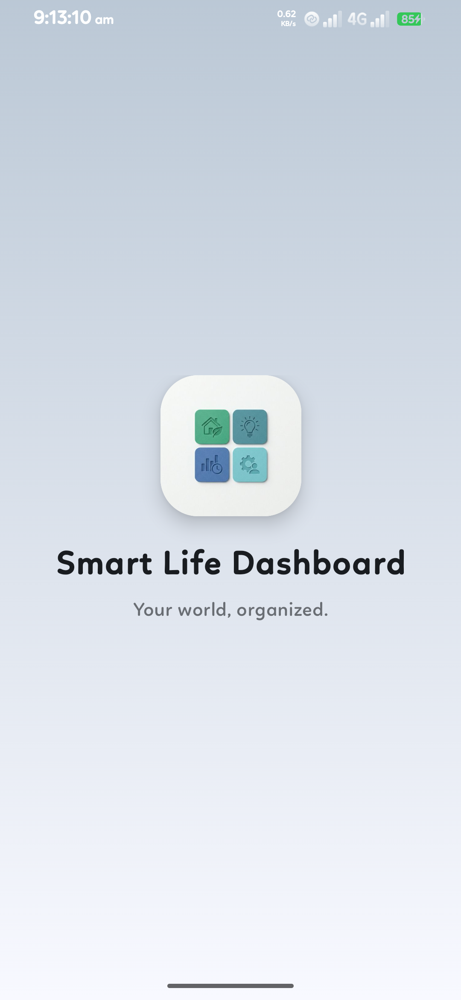 | 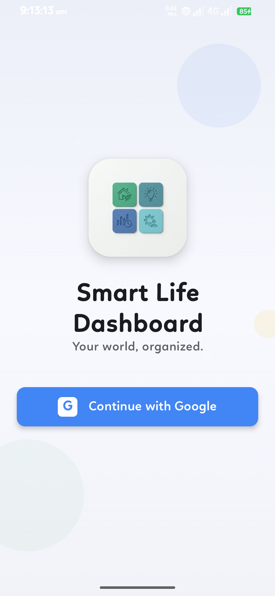 | 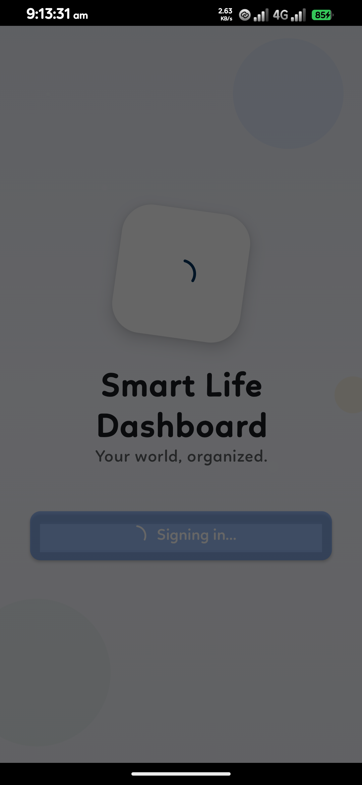 | 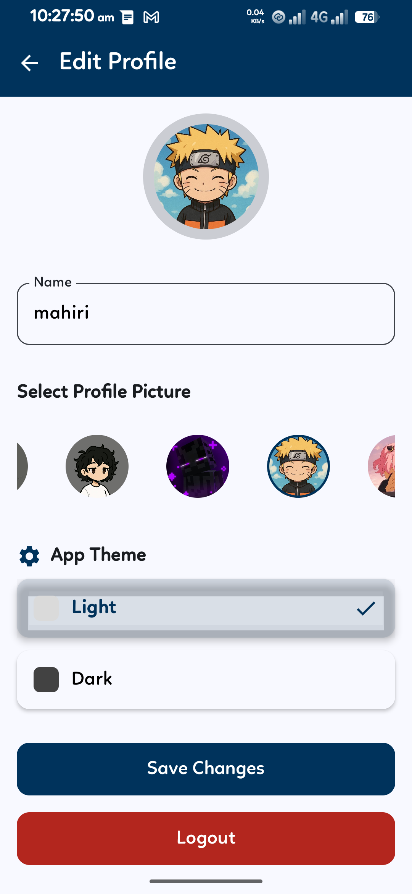 | 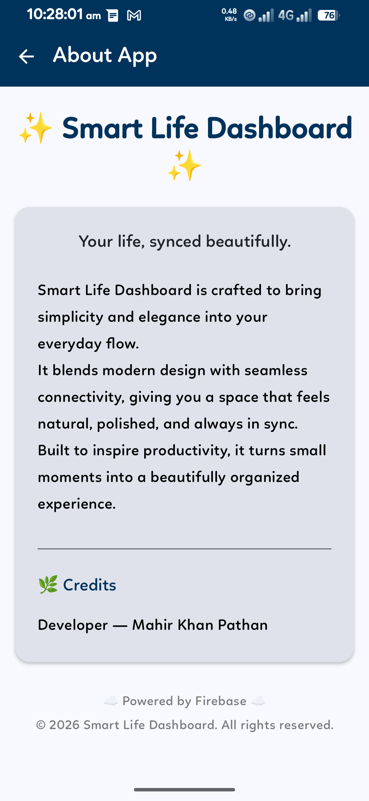 |

### Core Experience
| Dashboard | Weather | Quotes | Favourite Quotes |
| :---: | :---: | :---: | :---: |
| 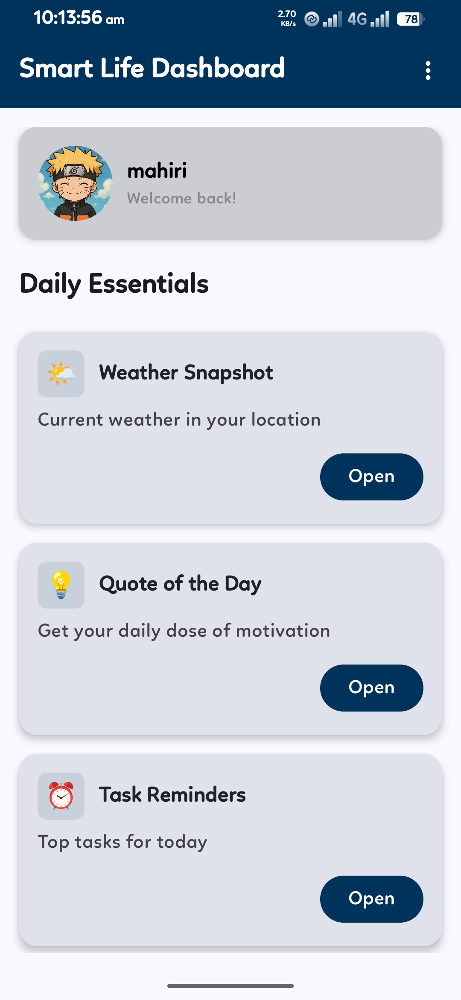 | 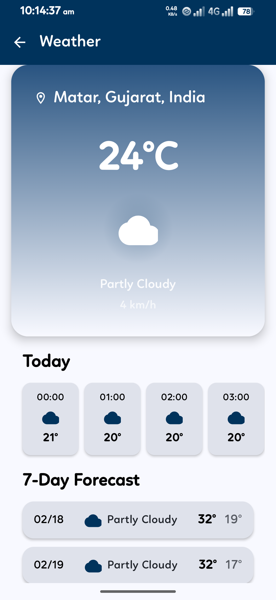 | 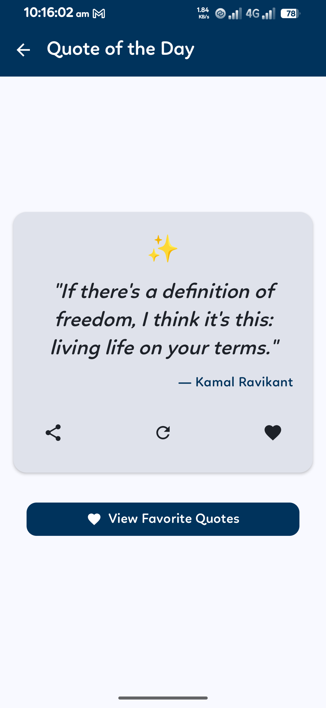 | 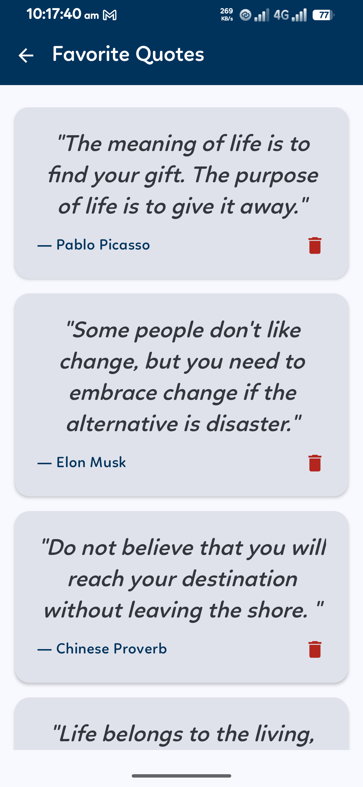 |

### Tasks & Notes
| Task Reminders | Add Task | Quick Notes | Add/Edit Notes |
| :---: | :---: | :---: | :---: |
| 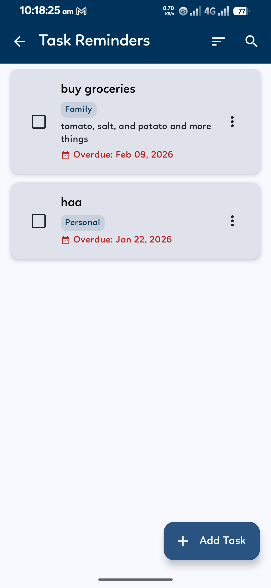 | 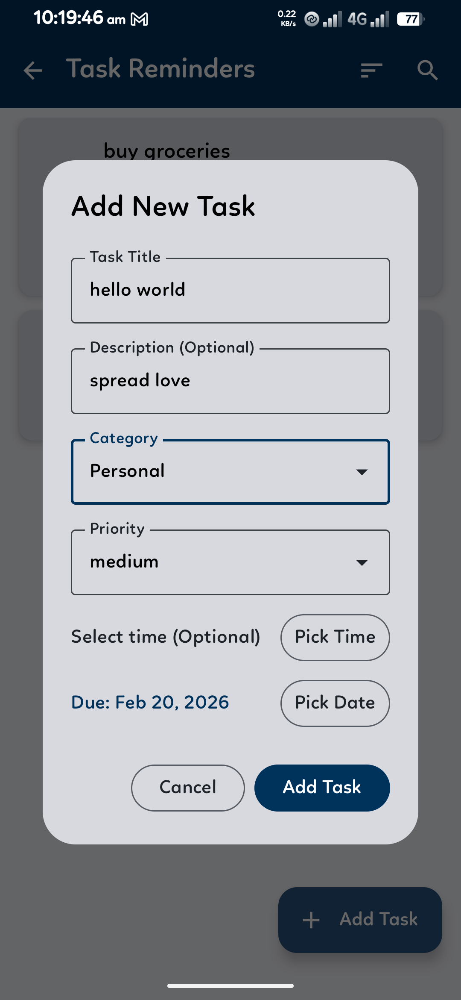 | 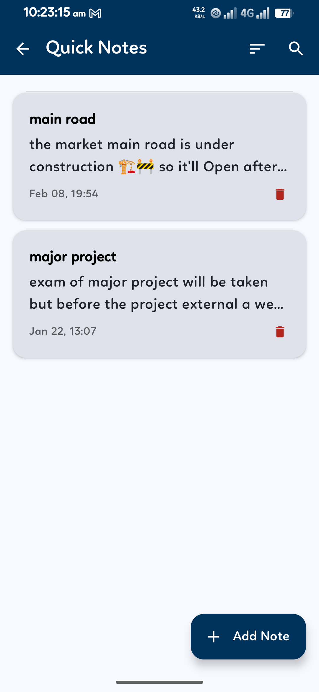 | 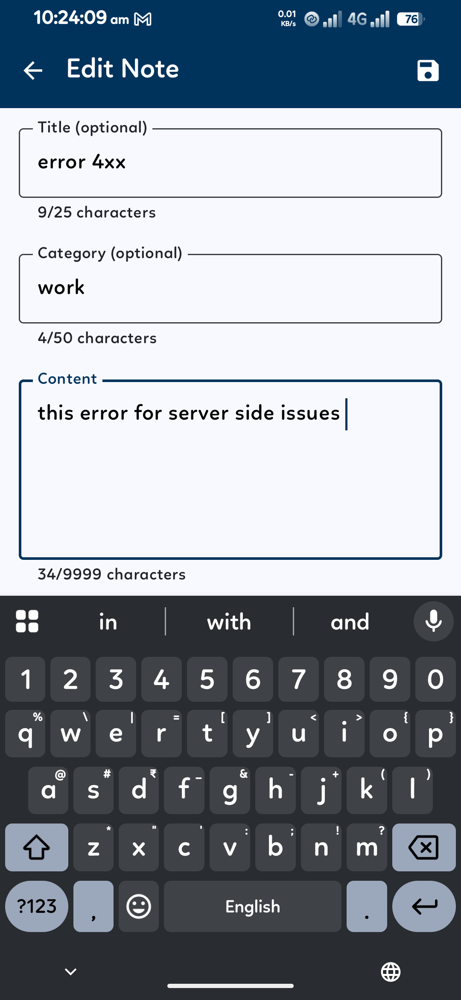 |

### Habit Tracker
| Habit Tracker | Add Habit | Habit Record |
| :---: | :---: | :---: |
| 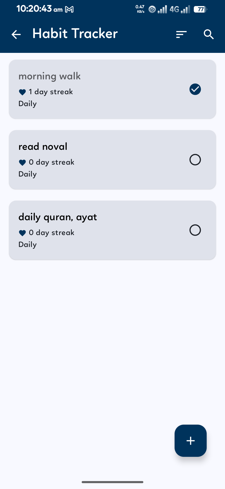 | 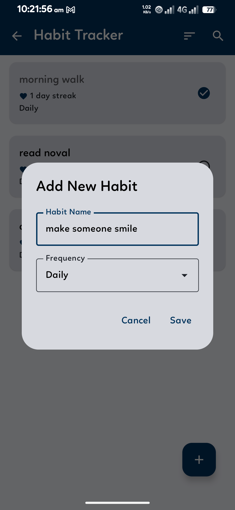 | 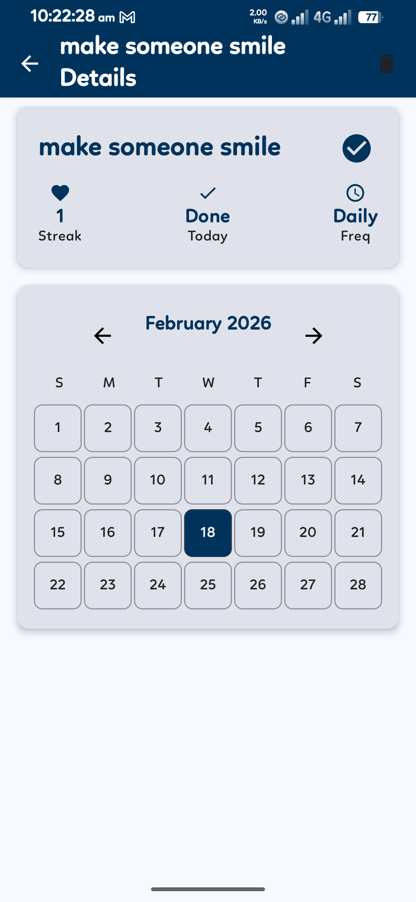 |

### Event Countdown
| Event Section | Add Event |
| :---: | :---: |
| 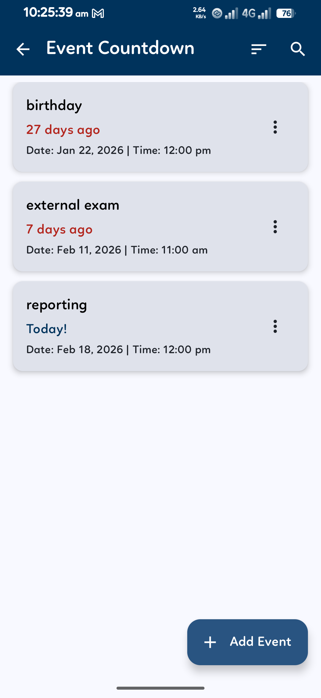 | 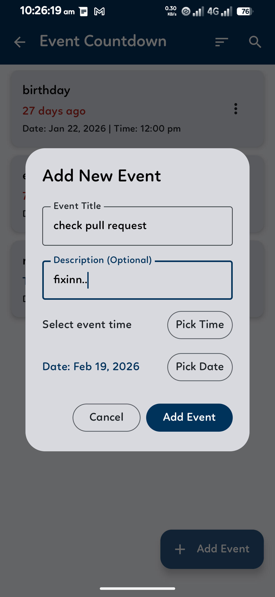 |

---

## 🚀 Getting Started

To run this project locally:

1. **Clone the repository:**
   ```bash
   git clone https://github.com/YOUR_USERNAME/SmartLifeDashboard.git
   ```
2. **Setup Firebase:**
   - Create a project on the [Firebase Console](https://console.firebase.google.com/).
   - Add an Android app with your package name (`com.example.smartlifedashboard`).
   - **Important:** Add your **SHA-1 fingerprint** in Project Settings for Google Sign-In to work.
   - Download the `google-services.json` and place it in the `app/` directory.
   - **Enable Authentication:** Go to *Authentication > Sign-in method* and enable **Google**.
   - **Setup Firestore:** Go to *Firestore Database* and create a database.
   - **Set Security Rules:** Use the following rules (also found in `firestore.rules`):
     ```javascript
     rules_version = '2';
     service cloud.firestore {
       match /databases/{database}/documents {
         match /users/{userId} {
           allow read, write: if request.auth != null && request.auth.uid == userId;
           match /{document=**} {
             allow read, write: if request.auth != null && request.auth.uid == userId;
           }
         }
       }
     }
     ```
3. **Open in Android Studio:**
   - Wait for Gradle sync to complete.
   - Run the app on an emulator or physical device.

---

## 🌿 Credits

- **Developer:** Mahir Khan Pathan
- **Design Inspiration:** Modern minimalist dashboard aesthetics.

---

## 📄 License

This project is licensed under the MIT License - see the [LICENSE](LICENSE) file for details.
